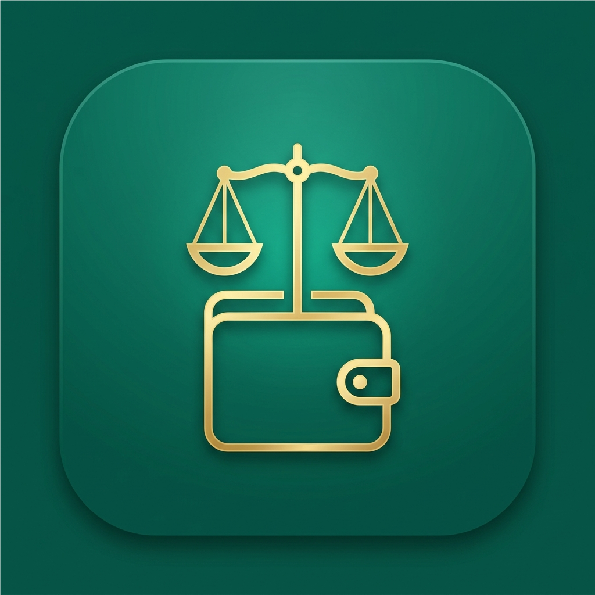

<div align="center">

  

  # ⚖️ Mizaan | ميزان
  ### Yemen Wallets Aggregator & Expense Tracker | مجمع المحافظ اليمنية ومتتبع المصاريف

  [](https://flutter.dev)
  [](https://dart.dev)
  [](https://flutter.dev)
  [](https://bloclibrary.dev)
  [-orange?style=for-the-badge)](https://docs.hivedb.dev)
  [](https://firebase.google.com)
  [](#license)

  <p align="center">
    <strong>تطبيق مالي ذكي وشامل لإدارة ومتابعة المحافظ والحسابات البنكية في اليمن تلقائياً وبكل خصوصية وأمان.</strong><br>
    <em>A modern, privacy-focused personal finance manager and Yemeni e-wallet aggregator powered by real-time SMS parsing, offline-first storage, and automated expense categorization.</em>
  </p>

  <p align="center">
    <a href="#-key-features">Key Features</a> •
    <a href="#-supported-wallets--banks">Supported Wallets</a> •
    <a href="#-tech-stack--architecture">Tech Stack</a> •
    <a href="#-project-structure">Project Structure</a> •
    <a href="#-getting-started">Getting Started</a> •
    <a href="#-privacy--security">Privacy & Security</a>
  </p>

</div>

---

## 📖 Overview | نبذة عن التطبيق

**Mizaan (ميزان)** solves the problem of financial fragmentation in Yemen by gathering all your electronic wallets, bank accounts, and cash balances into a single, unified, beautiful dashboard. 

Instead of opening multiple apps or manually recording every purchase, **Mizaan** automatically tracks income, POS payments, bills, and transfers through intelligent **SMS parsing engine** running directly on your device, while giving you complete offline access and optional secure cloud synchronization.

---

## ✨ Key Features | المميزات الرئيسية

### 📩 1. Automated SMS Parsing & Real-Time Tracking (Android)
* **Real-time Background Telephony Listener**: Instantly intercepts incoming bank SMS notifications and records transactions with zero manual effort.
* **Smart Extraction Engine**: Parses amounts, currencies (`YER`, `SAR`, `USD`), transaction types (*Income, Expense, Transfer, POS / Haseb, Cash Withdrawal*), and updated balances.
* **Inbox Batch Scanner**: Scans past transaction SMS messages with deduplication and auto-reconciliation.
* **Auto-Categorization**: Intelligently classifies spending into *Food & Dining, Groceries, Bills & Recharge, Transportation, Transfers, Salary, etc.*

### 💳 2. Multi-Wallet & Multi-Currency Management
* Aggregate multiple accounts across different currencies (**YER**, **SAR**, **USD**).
* Initial opening balance configuration with automatic balance reconciliation.
* Support for internal transfers between wallets.
* Quick-access favorite wallets on the home dashboard.

### ⚡ 3. Offline-First Architecture & Cloud Sync
* **100% Offline Capability**: Uses **Hive** local key-value database for ultra-fast response times without requiring an active internet connection.
* **Seamless Cloud Backup**: Automatic bidirectional synchronization with **Cloud Firestore** when connected.
* **Guest Mode**: Full functionality without mandatory login or cloud dependency.

### 🔐 4. High-Grade Security & Privacy
* **Biometric Lock**: Fingerprint and Face ID authentication via `local_auth`.
* **Automatic App Lifecycle Shield**: Auto-locks when the app is minimized or put in background.
* **Strict Privacy Guarantee**: 100% on-device SMS parsing — no SMS messages or sensitive personal details are ever transmitted to third-party servers.

### 📊 5. Visual Reports & Analytics
* Interactive and responsive visual charts powered by `fl_chart`.
* Category spending breakdown (pie/donut charts) and monthly cash flow distributions.
* Flexible time-period filters (Daily, Weekly, Monthly, Yearly).

### 🎨 6. Arabic-First Modern UI/UX
* Designed specifically for Arabic **Right-to-Left (RTL)** typography using the elegant **Cairo** font.
* **Material 3 Design System** with dynamic Light and Dark theme modes.
* Custom, hand-crafted vector animations built natively with Flutter's `AnimationController`.

---

## 🏦 Supported Wallets & Banks | البنوك والمحافظ المدعومة

Mizaan comes pre-configured with out-of-the-box regex templates for the most popular Yemeni banking institutions and electronic wallets:

| Wallet / Bank | المؤسسة المالية | Sender IDs | Supported Operations |
|:---|:---|:---|:---|
| **Al-Kuraimi Bank** | بنك الكريمي | `KuraimiMB`, `KIMB`, `Kuraimi`, `حاسب`, `Haseb` | Deposits, Haseb POS, Transfers, ATM, Salaries, Bills |
| **Jaib Wallet** | محفظة جيب (التضامن) | `Jaib`, `JAIB`, `Jeeb`, `TIB`, `Tadhamon` | Deposits, Purchases, P2P Transfers, Bills |
| **Kash Wallet** | محفظة كاش (YKB) | `Kash`, `KASH`, `YKB` | Deposits, Withdrawals, POS Purchases, Bills |
| **Muhafazati** | محفظتي (YOU / MTN) | `Muhafazati`, `YOU`, `MTN` | Cash-in, P2P Transfers, Merchant Payments, Top-ups |
| **Jawali** | جوالي (كاك بنك) | `Jawali`, `CACBank`, `CAC`, `YemenMobile` | Deposits, Bill Payments, Mobile Recharge, Withdrawals |
| **OneCash** | ون كاش (بنك القطيبي) | `OneCash`, `AlQutaibi`, `Qutaibi` | Transfers, Cash-in/out, POS payments |
| **Al-Amqi** | العمقي للصرافة | `AlAmqi`, `Alamqi`, `AMQI` | Remittances, Deposits, Outgoing Transfers |
| **Floosak** | فلوسك (بنك الشامل) | `Floosak`, `YBR` | Mobile Wallets, POS payments, Deposits |
| **Custom Wallets** | أي محفظة / صراف آخر | *User defined* | Dynamic regex parser & custom sender mapping |

> 💡 **Custom Templates:** Users can easily map new SMS sender names or define custom pattern templates right from the settings screen!

---

## 🛠 Tech Stack & Architecture

Mizaan follows a **Clean, Feature-Driven Architecture** utilizing the **BLoC / Cubit** pattern for maintainable, testable, and scalable code.

```
                         ┌────────────────────────┐
                         │   Presentation Layer   │
                         │ (UI Screens & Widgets) │
                         └───────────┬────────────┘
                                     │
                                     ▼
                         ┌────────────────────────┐
                         │   State Management     │
                         │   (BLoC / Cubits)      │
                         └───────────┬────────────┘
                                     │
                                     ▼
                         ┌────────────────────────┐
                         │    Repository Layer    │
                         │ (Data Abstraction API) │
                         └─────┬────────────┬─────┘
                               │            │
            ┌──────────────────┘            └──────────────────┐
            ▼                                                  ▼
┌────────────────────────┐                        ┌────────────────────────┐
│      Local Data        │                        │      Remote Data       │
│  - Hive (Boxes)        │                        │  - Cloud Firestore     │
│  - SharedPreferences   │                        │  - Firebase Auth       │
│  - Telephony (SMS)     │                        │                        │
└────────────────────────┘                        └────────────────────────┘
```

### Core Libraries:
* **State Management**: [`flutter_bloc`](https://pub.dev/packages/flutter_bloc) (`^8.1.6`), [`equatable`](https://pub.dev/packages/equatable)
* **Local Database**: [`hive`](https://pub.dev/packages/hive) (`^2.2.3`), [`hive_flutter`](https://pub.dev/packages/hive_flutter)
* **Backend & Authentication**: [`firebase_auth`](https://pub.dev/packages/firebase_auth), [`cloud_firestore`](https://pub.dev/packages/cloud_firestore)
* **SMS & Permissions (Android)**: [`telephony`](https://pub.dev/packages/telephony), [`permission_handler`](https://pub.dev/packages/permission_handler)
* **Biometrics & Notifications**: [`local_auth`](https://pub.dev/packages/local_auth), [`flutter_local_notifications`](https://pub.dev/packages/flutter_local_notifications)
* **Data Visualization**: [`fl_chart`](https://pub.dev/packages/fl_chart) (`^0.70.2`)
* **Localization & Formatters**: [`intl`](https://pub.dev/packages/intl)

---

## 📂 Project Structure

```
lib/
├── app.dart                    # App configuration, providers & lifecycle gate
├── firebase_options.dart       # Firebase platform configuration
├── main.dart                   # Application entry point & service initialization
├── core/
│   ├── constants/              # App constants, currencies & SMS regex registry
│   ├── router/                 # App routes and screen transitions
│   ├── theme/                  # Material 3 theme & ThemeCubit (Dark/Light)
│   └── utils/                  # Balance calculations, parsers & formatters
├── data/
│   ├── models/                 # Hive models (Wallet, Transaction)
│   ├── repositories/           # Repositories for Auth, Wallets & Transactions
│   └── services/               # Biometrics, Database (Hive), SMS & Notifications
└── features/
    ├── auth/                   # Firebase Authentication & Guest flow
    ├── favorites/              # Favorite wallets & quick access
    ├── home/                   # Main dashboard, summary cards & quick actions
    ├── onboarding/             # Intro tour & initial wallet setup
    ├── settings/               # App lock, custom templates, theme & cloud backup
    ├── sms/                    # SMS sync, review candidates & smart import
    ├── splash/                 # Hand-crafted custom splash animation
    ├── stats/                  # Analytics, category breakdown & charts
    ├── transactions/           # Transaction history, search & add/edit forms
    └── wallets/                # Wallet management, creation & balance overview
```

---

## 🚀 Getting Started

### Prerequisites
* [Flutter SDK](https://docs.flutter.dev/get-started/install) (`>= 3.12.2`)
* Android Studio / VS Code with Flutter extensions
* Android SDK (API Level 23+ recommended)
* A configured Firebase project (with Firestore & Auth enabled)

### Installation & Run

1. **Clone the repository:**
   ```bash
   git clone https://github.com/ibrahimadel000/Masroofy_app.git
   cd Masroofy_app
   ```

2. **Install dependencies:**
   ```bash
   flutter pub get
   ```

3. **Generate Hive type adapters (if needed):**
   ```bash
   dart run build_runner build --delete-conflicting-outputs
   ```

4. **Add Firebase configuration:**
   * Place your `google-services.json` inside `android/app/`
   * Place `GoogleService-Info.plist` inside `ios/Runner/` (if targeting iOS)

5. **Run the application:**
   ```bash
   flutter run
   ```

6. **Build release APK (Android):**
   ```bash
   flutter build apk --release
   ```

---

## 🧪 Testing & Verification

The project includes an extensive test suite covering SMS parsing algorithms, balance reconciliation, account data isolation, and state management:

```bash
# Run all unit and widget tests
flutter test
```

### Key Test Suites:
* `sms_parsing_test.dart`: Validates regex parsing against real-world SMS formats from Yemeni banks.
* `smart_sms_parser_test.dart`: Tests candidate selection, deduplication, and wallet matching logic.
* `wallet_balance_reconciliation_test.dart`: Verifies opening balance integrity across transactions.
* `account_isolation_test.dart`: Assures multi-user data segregation in Hive and Firestore.
* `auth_test.dart` & `stats_test.dart`: Covers authentication states and analytics calculations.

---

## 🛡️ Privacy & Permissions Notice

* **SMS Permissions (`READ_SMS`, `RECEIVE_SMS`)**:
  * Used **solely** on Android to automatically identify and parse financial messages from authorized financial service providers.
  * No personal conversations or unrelated messages are accessed, stored, or transferred.
  * On iOS, SMS reading is disabled in adherence to platform guidelines; manual transaction logging is provided seamlessly.
* **Biometric Authentication (`USE_BIOMETRIC`)**:
  * Secures local app access via device hardware (Fingerprint / Face ID). Biometric data never leaves the device.

---

## 👨‍💻 Author & Acknowledgements

Developed with ❤️ by **[Ibrahim Adel](https://github.com/ibrahimadel000)**

If you found this project helpful or inspiring, please consider giving it a ⭐ on GitHub!

---

## 📄 License

This project is licensed under the [MIT License](LICENSE) — see the LICENSE file for details.
